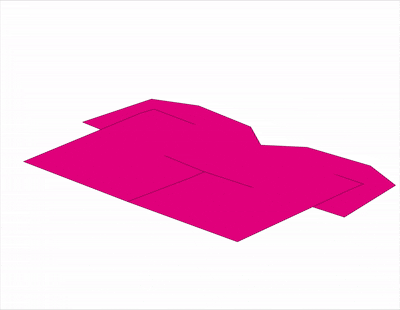
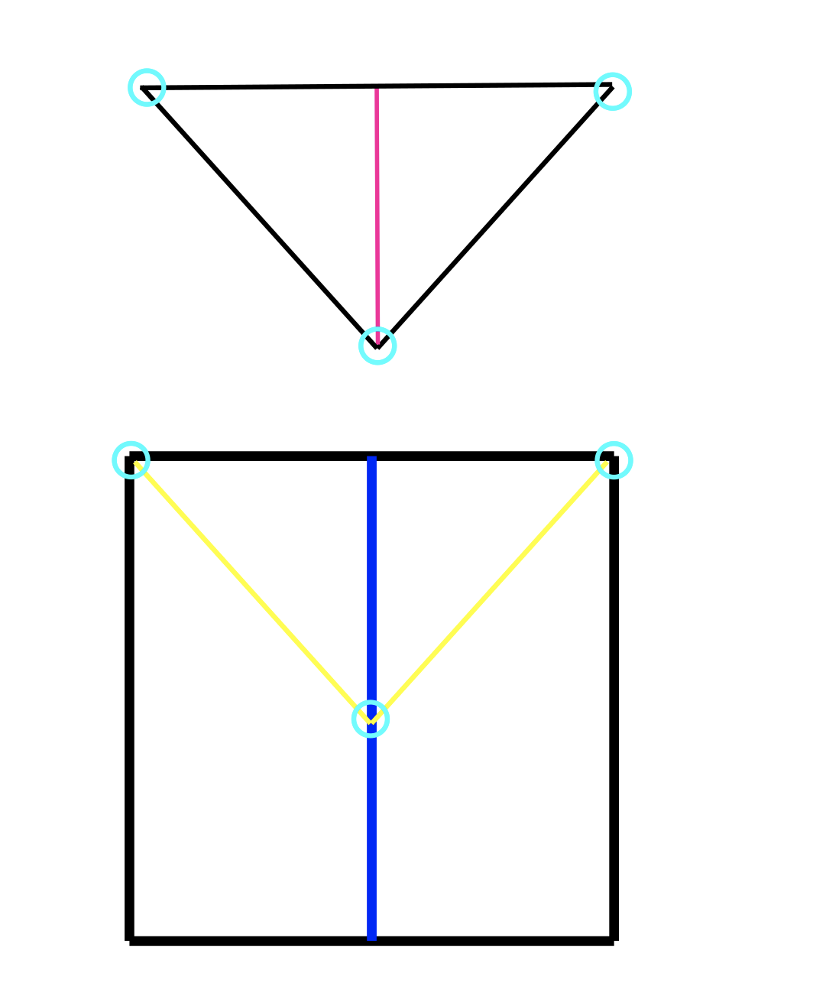
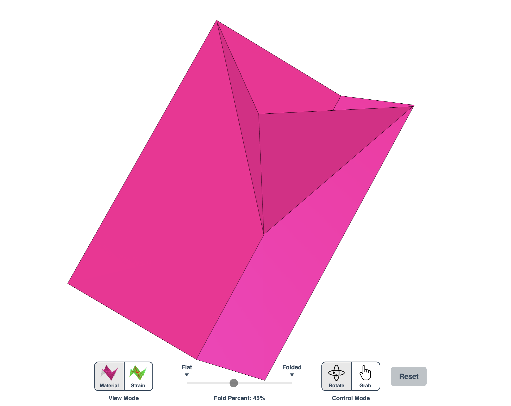
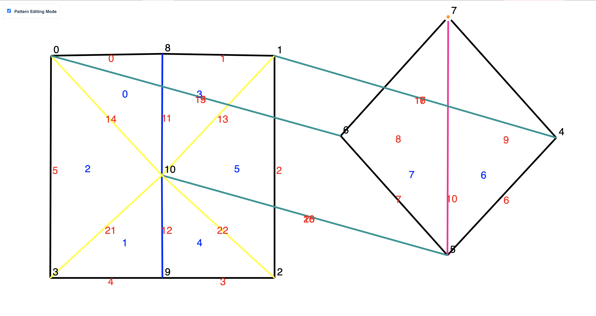

# Pop-Up Card Simulator
This is the repository for Nina De La Torre's final project for Computer Graphics. This repository is an extension of Origami Simulator created by Amanda Ghassaei in 2018. Everything below the OrigamiSimulator section is from the original repository explaining the original simulator. The write up for this project is found in the same directory holding this readme, but below are some demo videos of the pop-up simulator. 



# Demo Instructions
To run this demo yourself, you need to open up a live server first. **In the project root directory,** run 
```
python3 -m http.server 8000
```
the open 
```
http://localhost:8000
```
in your browser. An alternative way of running the demo is by opening the project folder in VS code, install the Live Server extension by Ritwick Dey, then while still inside VS Code, right click on index.html file and click "Open with Live Server". Once the server is open, click on "Examples" on the top bar, then hover over "180° Popups" to see some example pop-up cards and demo patterns. You can also create and upload your own crease patterns by creating a .svg file crease pattern. NOTE: I mainly use Inkscape to create svg files but you have to save as "Plain SVG". (Inkscape defaults to "Inkscape SVG")

# Glue Dots
Glue pieces of paper together by adding matching cyan circles. The circle outline color should be rgb(0, 0-255, 255). 

right angle v fold svg file and gif
<div style="text-align: center;">
  
  
</div>

# Pre-Creased Edges
Add pre-creased mountain by adding pink lines: rgb(255,0,155) or pre-creased valley folds by adding purple lines: rgb(155,0,255). Pre-creased edges are useful when you need a pop-up mechanism to "pop" a certain way. You could use magenta lines (freely swinging hinges), but this could end up with cases where the paper folds the wrong way. You could also use driven creases like a regular mountain fold (red) instead of a pre-creased mountain, but driven creases all have the same target angle, and your pop-up mechanisms might have different solution angles. 

box with magenta vs. precreased edge. 
</ul>
    
<ul>


# Collision Handling
Collision reaction defaults as off. You can turn collisions on/off by toggling the "Collisions are ON/OFF" switch in the upper right corner. Collision reaction still needs tuning, as self penetration still occurs often and the maximum distance has to be pretty large in order to detect them in time. I recomend setting "Num simulation steps per frame: " in Advanced Settings>Animation Settings to something really low (like 1-3), and messing with maximum distance slider in Simulation Settings. 

# Crease Pattern Editor
Go to the "Pattern" tab, turn on "Pattern Editing Mode" in the upper left corner, then hover above any node (corner) to highlight it, then click and drag to edit your crease pattern! Once you edit your pattern, go back to the Simulation tab to see the results. 
</ul>
    
<ul>


# Extra Credit
Nina confirms, on her honor, that she completed the course evaluation survey for this class. 


# OrigamiSimulator

Live demo at <a href="https://origamisimulator.org/">origamisimulator.org</a><br/>


This app allows you to simulate how any origami crease pattern will fold.  It may look a little different
from what you typically think of as "origami" - rather than folding paper in a set of sequential steps,
this simulation attempts to fold every crease simultaneously. It does this by iteratively solving for small displacements in the geometry of an initially flat sheet due to forces
exerted by creases.
You can read more about it in our paper:
<ul>
<li><a target="_blank" href="http://erikdemaine.org/papers/OrigamiSimulator_Origami7/">Fast, Interactive Origami Simulation using GPU Computation</a> by Amanda Ghassaei, Erik Demaine, and Neil Gershenfeld (7OSME)
</ul>

**If you have feedback about features you want to see in this app, please see [this thread](https://github.com/amandaghassaei/OrigamiSimulator/discussions/41).**

All simulation methods were written from scratch and are executed in parallel in several GPU fragment shaders for fast performance.
The solver extends work from the following sources:
<ul>
<li><a target="_blank" href="http://www3.eng.cam.ac.uk/~sdg/preprint/5OSME.pdf">Origami Folding: A Structural Engineering Approach</a> by Mark Schenk and Simon D. Guest<br/>
<li><a target="_blank" href="http://www.tsg.ne.jp/TT/cg/TachiFreeformOrigami2010.pdf">Freeform Variations of Origami</a> by Tomohiro Tachi<br/>
</ul>
<p>
This app also uses the methods described in <a href="http://www.cgg.cs.tsukuba.ac.jp/projects/2020/RulingAwareTriangulation/index.html" target="_blank">Simple Simulation of Curved Folds Based on Ruling-aware Triangulation</a> to import curved crease patterns and pre-process them in a way that realistically simulates the bending between the creases.
</p>

<p>
Originally built by <a href="http://www.amandaghassaei.com/" target="_blank">Amanda Ghassaei</a> as a final project for <a href="http://courses.csail.mit.edu/6.849/spring17/" target="_blank">Geometric Folding Algorithms</a>.
Other contributors include <a href="http://www.cgg.cs.tsukuba.ac.jp/~sasaki_k/" target="_blank">Sasaki Kosuke</a>, <a href="http://erikdemaine.org/" target="_blank">Erik Demaine</a>, and <a href="https://github.com/amandaghassaei/OrigamiSimulator/graphs/contributors" target="_blank">others</a>.
Code available on <a href="https://github.com/amandaghassaei/OrigamiSimulator" target="_blank">Github</a>.  If you have interesting crease patterns that would
make good demo files, please send them to me (Amanda) so I can add them to the <b>Examples</b> menu.  My email address is on my website.  Thanks!<br/>
</p><br/>
<b>Instructions:</b><br/><br/>
<br/>

<ul>
    <li>Slide the <b>Fold Percent</b> slider to control the degree of folding of the pattern (100% is fully folded, 0% is unfolded,
        and -100% is fully folded with the opposite mountain/valley assignments).</li>
    <li>Drag to rotate the model, scroll to zoom.</li>
    <li>Import other patterns under the <b>Examples</b> menu.</li>
    <li>Upload your own crease patterns in SVG or <a href="https://github.com/edemaine/fold" target="_blank">FOLD</a> formats, following <a href="#" class="goToImportInstructions">these instructions</a>.</li>
    <li>Export FOLD files or 3D models ( STL or OBJ ) of the folded state of your design ( <b>File > Save Simulation as...</b> ).</li>
</ul>
    
<ul>
    <li>Visualize the internal strain of the origami as it folds using the <b>Strain Visualization</b> in the left menu of the <b>Advanced Options</b>.</li>
</ul>
    <br/>
<ul>
    <li>If you are working from a computer connected to a VR headset and hand controllers, follow <a href="#" id="goToViveInstructions">these instructions</a>
        to use this app in an interactive virtual reality mode. (sorry I think this may be deprecated now!)</li>
</ul>

<br/>
<b>External Libraries:</b><br/><br/>
<ul>
    <li>All rendering and 3D interaction done with <a target="_blank" href="https://threejs.org/">three.js</a></li>
    <li><a href="https://github.com/fontello/svgpath" target="_blank">svgpath</a> and <a href="https://www.npmjs.com/package/path-data-polyfill" target="_blank">path-data-polyfill</a> helps with SVG path parsing</li>
    <li><a href="https://github.com/edemaine/fold" target="_blank">FOLD</a> is used as the internal data structure, methods from the
        <a href="https://github.com/edemaine/fold/blob/master/doc/api.md" target="_blank">FOLD API</a> used for SVG parsing</li>
    <li>Arbitrary polygonal faces of imported geometry are triangulated using the <a target="_blank" href="https://github.com/mapbox/earcut">Earcut Library</a> and <a href="https://github.com/mikolalysenko/cdt2d" target="_blank"></a>cdt2d</a></li>
    <li><a href="http://www.numericjs.com/" target="_blank">numeric.js</a> for linear algebra operations</li>
    <li>GIF and WebM video export uses <a target="_blank" href="https://github.com/spite/ccapture.js/">CCapture</a></li>
</ul>
<p>
<br/>
You can find additional information in <a href="http://erikdemaine.org/papers/OrigamiSimulator_Origami7/" target="_blank">our 7OSME paper</a> and <a href="http://www.amandaghassaei.com/projects/origami_simulator/" target="_blank">project website</a>.
If you have feedback about features you want to see in this app, please see <a href="https://github.com/amandaghassaei/OrigamiSimulator/discussions/41" target="_blank">this thread</a>.
<br/>
</p>
